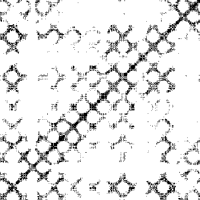
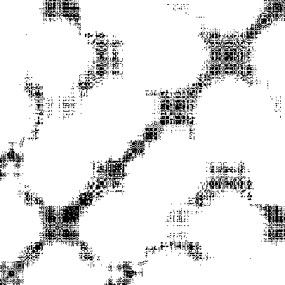
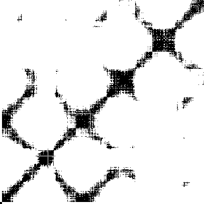
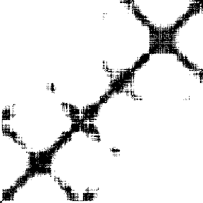
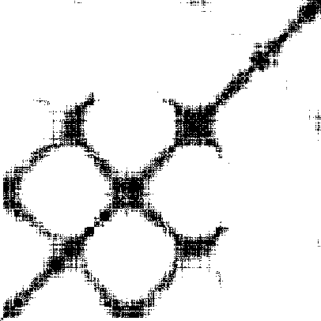
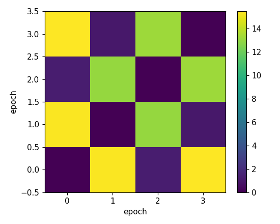
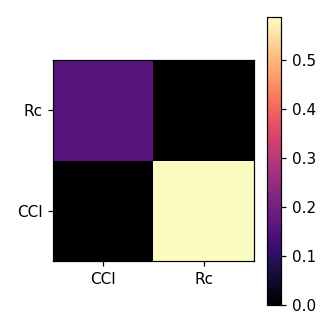
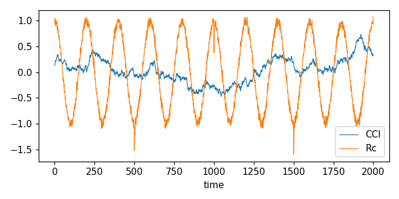

# Fast Analysis Report


## Configuration


```json
{
  "steps": 2000,
  "epochs": 4,
  "shock_every": 500,
  "outputs": "outputs_fast_smoke",
  "n_surrogates": 6,
  "tau_percentile": 10,
  "max_lag": 4,
  "dtw_mode": "pca1",
  "seed": 42,
  "profile": true
}
```


## RQA Global


|metric|value|

|---|---|

|RR|0.1|

|DET|0.863885|

|LAM|0.8989975|

|Lmax|2000|

|ENTR|2.3589020860162058|

|TT|7.921729744019033|


## RQA per-epoch


```
 epoch      tau  RR     DET     LAM  Lmax     ENTR       TT
     0 1.376615 0.1 0.69680 0.76552   500 1.435083 3.641172
     1 0.872829 0.1 0.86192 0.89432   500 2.232901 7.044108
     2 0.874319 0.1 0.88592 0.91296   500 2.399691 8.459600
     3 0.831192 0.1 0.84128 0.88004   500 2.157986 6.349495
```


## DTW matrix


Epoch×Epoch DTW matrix:

```
0.000  15.345  1.260  15.456
15.345  0.000  13.004  0.982
1.260  13.004  0.000  13.168
15.456  0.982  13.168  0.000
```


## Granger Results


|test|p|stat|selected_lag|

|---:|---:|---:|---:|

|CCI->Rc|0.2579|1.326|4|

|Rc->CCI|0.6956|0.5547|4|


## Figures



















## Conclusions


- Quick summary: global RR=0.100, DET=0.864

- DTW indicates distances between epochs (see heatmap).

- Granger causality p-values suggest: CCI->Rc p=0.2579, Rc->CCI p=0.6956.


## Next steps


- may Increase surrogates to test stability of RQA z-scores.

- Run Transfer Entropy or multivariate causality if needed.

## Methods
Briefly state datasets, parameters, seeds, and procedures.

## Limitations
List key caveats (sampling bias, small N, model assumptions).

## Evidence & Links
- [Link 1](#)
- [Link 2](#)

Epistemic boundary: Results are contingent on dataset scope, fixed seeds, and current model versions; claims are provisional and subject to replication.
